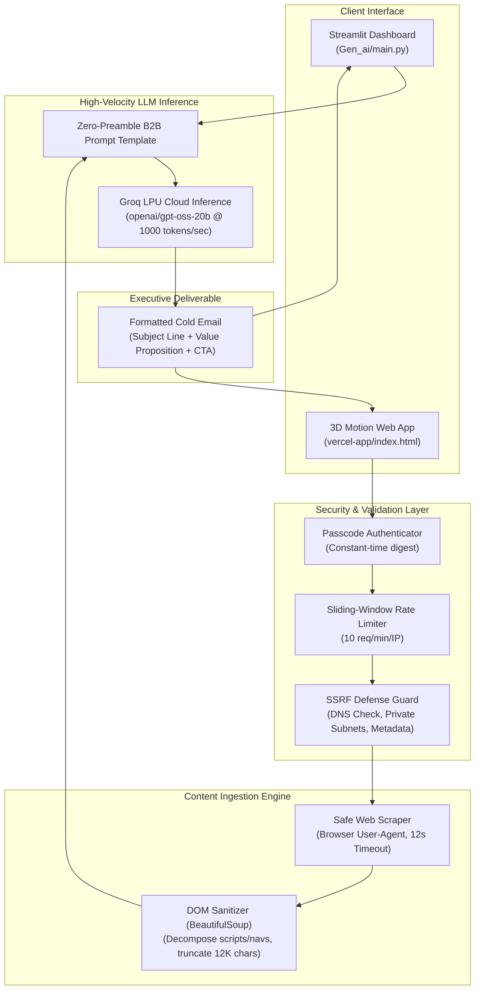

<div align="center">

# 📧 AI Cold Email Generator
### *Autonomous B2B Client Acquisition Powered by Groq LPUs & LangChain*

[](https://www.python.org/)
[-f55036?logo=speedtest&logoColor=white)](https://groq.com/)
[](https://www.langchain.com/)
[](https://streamlit.io/)
[](https://vercel.com/)
[](https://opensource.org/licenses/MIT)

<p align="center">
  Transform live job posting URLs into hyper-tailored, executive-ready cold outreach pitches in milliseconds.<br>
  Built with high-velocity inference, defensive SSRF architecture, and dual deployment targets.
</p>

[Explore Vercel Demo](https://ai-cold-email-generator.vercel.app) • [Explore Streamlit Demo](https://ai-cold-email-generator.streamlit.app) • [View Architecture](#-architecture--dual-engine-design)

---

</div>

## 📑 Table of Contents

- [Overview](#-overview)
- [Live Demo Links](#-live-demo-links)
- [Architecture & Dual-Engine Design](#-architecture--dual-engine-design)
  - [Streamlit Implementation vs. Vercel Serverless Rebuild](#streamlit-implementation-vs-vercel-serverless-rebuild)
  - [System Flow Diagram](#system-flow-diagram)
- [Tech Stack](#-tech-stack)
- [Local Development Setup](#-local-development-setup)
- [Deployment Guide](#-deployment-guide)
  - [1. Streamlit Community Cloud](#1-deploy-to-streamlit-community-cloud)
  - [2. Vercel Serverless](#2-deploy-to-vercel)
- [Enterprise-Grade Security Architecture](#-enterprise-grade-security-architecture)
  - [SSRF Mitigation Engine](#ssrf-mitigation-engine)
  - [Rate Limiting & Authentication](#rate-limiting--authentication)
- [Known Limitations & Troubleshooting](#-known-limitations--troubleshooting)
- [License](#-license)

---

## 💡 Overview

Modern business development executives (BDEs), agency founders, and software consultants spend dozens of hours every week scouring corporate job boards to find contract opportunities. When an enterprise (e.g., Nike) posts an opening for a *Senior Cloud Infrastructure Engineer*, service companies can offer qualified contractor teams immediately—saving the client months of hiring latency and recruitment overhead.

However, generic cold outreach emails convert poorly, while manual personalization takes 20–30 minutes per lead.

**AI Cold Email Generator** completely automates this pipeline:
1. **Targeting**: Accepts any public job posting URL (Greenhouse, Lever, Nike Careers, corporate portals).
2. **Extraction**: Intelligently scrapes and isolates job requirements, technical stacks, and organizational needs.
3. **Synthesis**: Directs Groq's high-speed Language Processing Units (LPUs) to draft an authoritative, personalized pitch presenting relevant service capabilities with zero conversational filler or preambles.

---

## 🌐 Live Demo Links

| Deployment | URL | Status & Availability |
| :--- | :--- | :--- |
| **Vercel Serverless (Recommended)** | **[ai-cold-email-generator.vercel.app](https://ai-cold-email-generator.vercel.app)** | ⚡ **Always On** • Zero cold-start latency • Passcode-protected |
| **Streamlit Community Cloud** | **[ai-cold-email-generator.streamlit.app](https://ai-cold-email-generator.streamlit.app)** | 💤 *Free-tier hosting* • Enters sleep mode after inactivity (may require a brief "Wake up" click) |

---

## 🏗️ Architecture & Dual-Engine Design

This repository contains **two parallel implementations** engineered for different operational environments:

```text
AI-Cold-Email-Generator/
├── Gen_ai/
│   └── main.py          # 1. Original Stateful Streamlit Application
├── vercel-app/          # 2. Serverless Production Rebuild
│   ├── api/
│   │   └── generate.py  # Python Serverless Function (SSRF-protected, Rate-limited)
│   ├── index.html       # 3D Interactive UI (Three.js + Tailwind CSS)
│   └── vercel.json      # Function runtime parameters
├── requirements.txt     # Global dependencies
└── app.py               # Root entry forwarder
```

### Streamlit Implementation vs. Vercel Serverless Rebuild

Why do both exist?

| Evaluation Axis | Original Version (`Gen_ai/main.py`) | Serverless Rebuild (`vercel-app/`) |
| :--- | :--- | :--- |
| **Primary Goal** | Rapid prototyping, exploratory analysis & vector RAG | Production web deployment, instant responsiveness & high availability |
| **Hosting Model** | Stateful Python container (Streamlit Cloud, Docker) | Ephemeral serverless function (Vercel Lambda) |
| **Uptime Characteristic** | Sleeps after 7 days of inactivity on free tiers | **Always on**, instant wake-up, auto-scaling to zero |
| **Bundle & Memory** | Heavy (~500MB+ with LangChain, ChromaDB, PyTorch) | **Ultra-lightweight** (~15MB; standard library + `requests` + `beautifulsoup4`) |
| **Security Layer** | Basic UI inputs, environment variables | **SSRF defense engine**, recursive redirect validation, sliding-window rate limiting, constant-time passcode check |
| **User Experience** | Classic scientific dashboard | 3D motion-enhanced UI with Three.js particle dynamics, card tilt physics & glassmorphism |

### System Flow Diagram



---

## 🛠️ Tech Stack

### AI & LLM Inference
- **[Groq Cloud API](https://console.groq.com/)**: Hardware-accelerated LPU inference delivering generation speeds over **1,000 tokens/second** using `openai/gpt-oss-20b`, `openai/gpt-oss-120b`, and `qwen/qwen3.8-27b`.
- **[LangChain](https://www.langchain.com/)**: Prompt template composition and document loading (`WebBaseLoader`).

### Frontend Interfaces
- **Streamlit**: Rapid interactive data-science UI for local execution and experimentation.
- **Vanilla Modern JS / HTML5 / Tailwind CSS**: Single-page application styled with glassmorphic cards and isometric controls.
- **[Three.js](https://threejs.org/)**: Hardware-accelerated 3D WebGL particle constellation responding to mouse parallax.

### Backend & Serverless
- **Vercel Serverless Functions**: Zero-dependency Python HTTP handler (`http.server.BaseHTTPRequestHandler`).
- **BeautifulSoup4 & Requests**: Resilient DOM parsing, tag stripping, and web text normalization.
- **ChromaDB**: Lightweight vector database utilized in the exploratory notebook pipeline for semantic portfolio retrieval.

---

## 💻 Local Development Setup

Follow these steps to run the application locally on your machine.

### Prerequisites
- Python 3.10, 3.11, or 3.12 installed
- Git installed
- A free Groq API Key from [console.groq.com/keys](https://console.groq.com/keys)

### Step 1: Clone the Repository
```bash
git clone https://github.com/DhurvXD/AI-Cold-Email-Generator.git
cd AI-Cold-Email-Generator
```

### Step 2: Create a Virtual Environment & Install Dependencies
```bash
# macOS/Linux
python3 -m venv venv
source venv/bin/activate

# Windows (PowerShell)
python -m venv venv
.\venv\Scripts\Activate.ps1

# Install required packages
pip install -r requirements.txt
```

### Step 3: Configure Environment Variables
Create a `.env` file in the root of your project:
```bash
# Copy the example template
cp .env.example .env
```
Open `.env` and insert your Groq API key:
```ini
GROQ_API_KEY=your_groq_api_key_here
```

> [!CAUTION]
> **Strict Security Rule:** Never hardcode your API key into Python scripts or commit `.env` to GitHub. The root `.gitignore` is configured to prevent sensitive files from being tracked.

### Step 4: Run the Application Locally

#### Option A: Run the Streamlit Version
```bash
streamlit run Gen_ai/main.py
```
Open your browser at `http://localhost:8501`.

#### Option B: Run the Vercel Serverless App Locally
You can use the official Vercel CLI to test the serverless function and 3D UI simultaneously:
```bash
npm i -g vercel
cd vercel-app
vercel dev
```

---

## 🚀 Deploying Your Own Copy

### 1. Deploy to Streamlit Community Cloud

1. Fork or push this repository to your GitHub account.
2. Sign in to [share.streamlit.io](https://share.streamlit.io/).
3. Click **"New app"** and specify:
   - **Repository:** `YourUsername/AI-Cold-Email-Generator`
   - **Branch:** `master`
   - **Main file path:** `Gen_ai/main.py`
4. Expand **Advanced settings** &rarr; **Secrets** and enter:
   ```toml
   GROQ_API_KEY = "your_groq_api_key_here"
   ```
5. Click **Deploy**.

---

### 2. Deploy to Vercel

1. Push your repository to GitHub.
2. Log in to [vercel.com/new](https://vercel.com/new) and import the repository.
3. Configure the project settings:
   - **Root Directory:** Click **Edit** and set it to `vercel-app`.
   - **Framework Preset:** Select **Other**.
4. Expand **Environment Variables** and add:
   - `GROQ_API_KEY` = `your_groq_api_key_here`
   - `APP_PASSCODE` = `your_secret_passcode_here` *(Protects your serverless endpoint from public abuse)*
5. Click **Deploy**. Your serverless application will be live in under 60 seconds with automatic SSL.

---

## 🛡️ Enterprise-Grade Security Architecture

Public AI web applications that scrape URLs are vulnerable to **Server-Side Request Forgery (SSRF)** and API budget exhaustion. The Vercel serverless engine ([`vercel-app/api/generate.py`](vercel-app/api/generate.py)) includes defense-in-depth mitigations:

### SSRF Mitigation Engine
- **Scheme Whitelist**: Restricts inputs to `http` and `https` only. File schemes (`file://`), loopback schemes, and internal protocols are rejected immediately.
- **DNS Resolution Inspection**: Resolves hostnames against DNS and evaluates all returned IP addresses. Any address mapping to:
  - Loopback (`127.0.0.0/8`, `::1`)
  - RFC 1918 Private Ranges (`10.0.0.0/8`, `172.16.0.0/12`, `192.168.0.0/16`)
  - Link-Local and Multicast spaces (`169.254.0.0/16`, `224.0.0.0/4`)
  - Cloud Metadata Endpoints (`169.254.169.254` AWS/GCP/Azure instance metadata)
  is blocked with a descriptive `400 Bad Request`.
- **Redirect Chain Validation**: HTTP 301/302 redirects are intercepted and inspected individually up to 3 hops, preventing attackers from bypassing DNS filters via external redirectors.

### Rate Limiting & Authentication
- **Passcode Gate**: Requires requests to present a passcode that matches `APP_PASSCODE` using `secrets.compare_digest()` to eliminate timing-attack vulnerabilities.
- **Sliding-Window Limiter**: Restricts request bursts to a maximum of 10 requests per minute per IP address.
- **Payload Boundaries**: Rejects payloads exceeding 100KB, truncates scraped text to 12,000 characters, and limits string inputs to prevent memory exhaustion.

---

## ⚠️ Known Limitations & Troubleshooting

1. **Anti-Scraping / Bot-Protected Career Portals**:
   - Web pages requiring JavaScript rendering (single-page React/Angular apps without SSR) or protected by Cloudflare Turnstile/CAPTCHAs (e.g., LinkedIn Jobs behind a login wall) may block automated scrapers.
   - *Workaround:* Use direct corporate job URLs (e.g., Greenhouse, Lever, Workday) or paste publicly crawlable links.

2. **Groq Model Name Lifecycle**:
   - High-throughput LLM models are continuously updated. If you encounter an error stating:
     `'The model ... does not exist or you do not have access to it.'`
     verify active model IDs directly at [Groq Supported Models Documentation](https://console.groq.com/docs/models). The codebase currently uses `openai/gpt-oss-20b`, `openai/gpt-oss-120b`, and `qwen/qwen3.8-27b`.

3. **Streamlit Sleep Mode**:
   - Community Cloud instances sleep after prolonged inactivity. Simply click the interface's wake-up button to restart the container, or use the **Vercel Serverless Edition** which is always available.

---

## 📄 License

This project is licensed under the [MIT License](LICENSE). You are free to use, modify, and distribute this software for personal and commercial projects.
